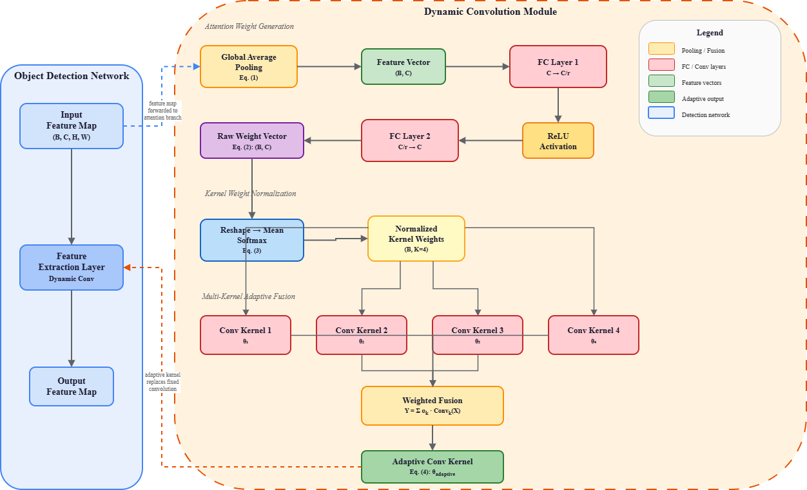

# **DyCo-STD: An Improved Algorithm for Small Target Detection in Remote Sensing Imagery Based on Dynamic Convolution**

[](https://www.python.org/downloads/)
[](https://pytorch.org/)
[](LICENSE)

## Introduction

This study addresses the issues associated with low accuracy and high false negatives resulting from using traditional fixed-parameter convolution kernels to perform small target detection in a number of different remote sensing images. The approach uses an improved method that employs dynamic convolution. First, global average pooling is performed on the input feature map to create a channel statistic, and then two fully connected layers are utilized to compute channel level attention weights. Using the softmax function, the channel level attention weights are normalized, appropriately weighted and then combined with a predefined convolutional kernel to produce an adaptive convolutional kernel for the features being input. Next, this adaptive convolutional kernel is utilized to convolution the feature extraction layer in order to create a dynamically optimized receptive field for detecting small targets in the process of performing the experiment. Results show a mAP (mean average precision) of 42.3% and a false negative rate of 55.7% for detection of targets between 10 and 20 pixels in size, verifying the key role of dynamic convolution technology in improving the robustness of small target detection in remote sensing images.



### Key Highlights

- **Adaptive receptive fields**: Convolution kernel parameters are dynamically generated per input, enabling real-time adaptation to scale variations
- **Improved small target detection**: mAP reaches 42.3% for 10-20px targets (+13.8% over traditional convolution)
- **Reduced false negatives**: Miss rate drops from 78.3% to 55.7% for the smallest targets (10-20px)
- **Robust to complex backgrounds**: Maintains 47.8% mAP at extreme background complexity (Level 5), while traditional convolution drops to 30.6%
- **Enhanced feature SNR**: Gradient SNR improves by 37.5% in small target regions

## Results

### Miss Rate and Gradient SNR by Target Size


**Left (a):** Dynamic convolution reduces the miss rate by up to **22.6%** for 10-20px targets.  
**Right (b):** Gradient SNR improves across all target sizes, indicating stronger feature responses in small target regions.

### Robustness Under Complex Backgrounds


**Left (a):** Dynamic convolution maintains mAP above 47.8% even at the most challenging background level (Level 5), outperforming traditional convolution by **17.2%**.  
**Right (b):** The gradient SNR gap widens under complex backgrounds — dynamic convolution at Level 5 (2.16) still exceeds traditional convolution at Level 3 (1.95).

## Requirements

```bash
conda create -n dycostd python=3.9
conda activate dycostd
pip install -r requirements.txt
```

### Dependencies

- Python >= 3.8
- PyTorch >= 2.0
- torchvision
- numpy

## Quick Start

```python
import torch
from models import DynamicConv2d, DynamicConvFPN

# Standalone Dynamic Convolution
x = torch.randn(2, 64, 32, 32)
conv = DynamicConv2d(in_channels=64, out_channels=128, K=4)
y = conv(x)  # (2, 128, 32, 32)

# FPN Integration (C3, C4, C5 levels)
fpn = DynamicConvFPN(fpn_channels=(512, 1024, 2048), K=4)
c3 = torch.randn(1, 512, 64, 64)
c4 = torch.randn(1, 1024, 32, 32)
c5 = torch.randn(1, 2048, 16, 16)
c3_out, c4_out, c5_out = fpn(c3, c4, c5)
```

### Adaptive BBox Regression Loss

```python
from losses import AdaptiveBBoxRegressionLoss

loss_fn = AdaptiveBBoxRegressionLoss(beta=1.0)
loss = loss_fn(pred_bbox, gt_bbox, feature_map)
```

## Repository Structure

```
DyCo-STD/
├── README.md                          # This file
├── CITATION.cff                       # Citation metadata
├── requirements.txt                   # Python dependencies
├── .gitignore                         # Git ignore rules
├── LICENSE                            # MIT License
├── config.py                          # Hyperparameters
├── models/
│   ├── __init__.py
│   └── dynamic_conv.py                # DynamicConv2d, DynamicConvFPN
├── losses/
│   ├── __init__.py
│   └── adaptive_bbox_loss.py          # SNR-based adaptive bbox loss
├── figures/
│   ├── architecture.png               # Exported architecture diagram
│   ├── miss_rate_snr.png      		# Miss rate & SNR by target size
│   └── background_complexity.png  	# Robustness under complex backgrounds
└── figures/                           # Additional figures
```

## Training Protocol

Matching the paper (Sec. 3.3):

| Parameter | Value |
|-----------|-------|
| Optimizer | SGD |
| Momentum | 0.9 |
| Weight decay | 1e-4 |
| Initial LR | 0.001 |
| LR schedule | Cosine annealing |
| Backbone | Frozen |
| Fine-tuned | DynamicConv + Detection head |

## Citations

This paper has been accepted by [ComSIA 2026](https://comsia.in/prevconf2026.html). If you find this work helpful, please cite:

```bibtex
@inproceedings{qu2027improved,
  author    = {Qu, Guanheng and Wang, Yongyan and Shen, Zuyan},
  title     = {An Improved Algorithm for Small Target Detection in Remote Sensing Imagery Based on Dynamic Convolution},
  booktitle = {Proceedings of International Conference on Computing Systems and Intelligent Applications (ComSIA)},
  year      = {2026},
  pages     = {35--45},
  publisher = {Springer},
  isbn      = {978-3-032-30954-9},
  doi       = {10.1007/978-3-032-30954-9_4}
}
```
or
```
@software{Qu_DyCo-STD_2026,
  author = {Qu, Guanheng and Wang, Yongyan and Shen, Zuyan},
  doi = {10.5281/zenodo.20051973},
  month = jul,
  title = {{DyCo-STD}},
  url = {https://github.com/Unk1ndledAC/DyCo-STD},
  version = {1.0.1},
  year = {2026}
}
```

## License

This project is licensed under the MIT License — see the [LICENSE](LICENSE) file for details.
